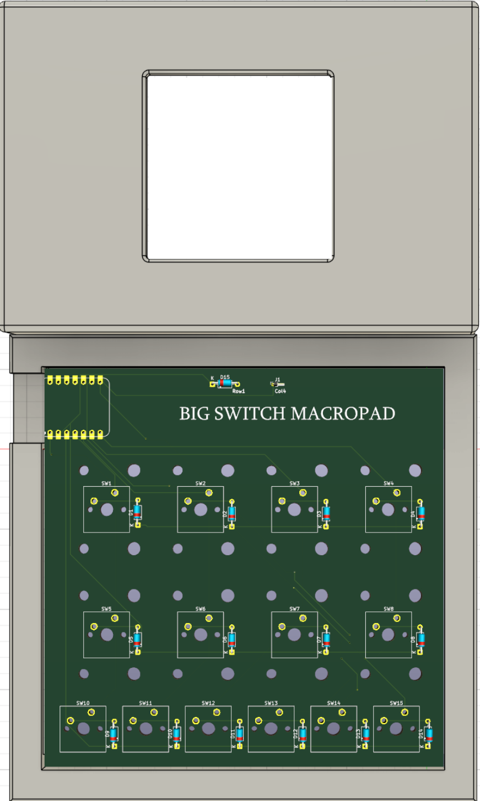
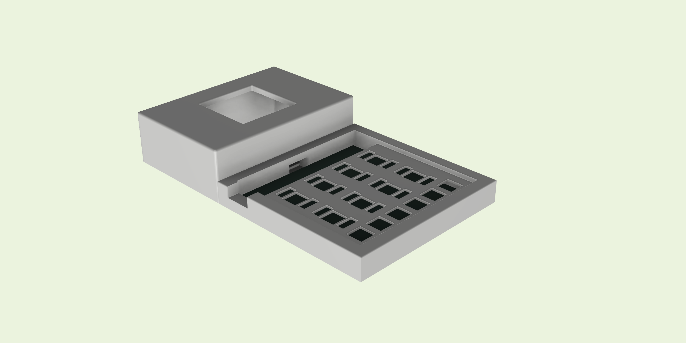
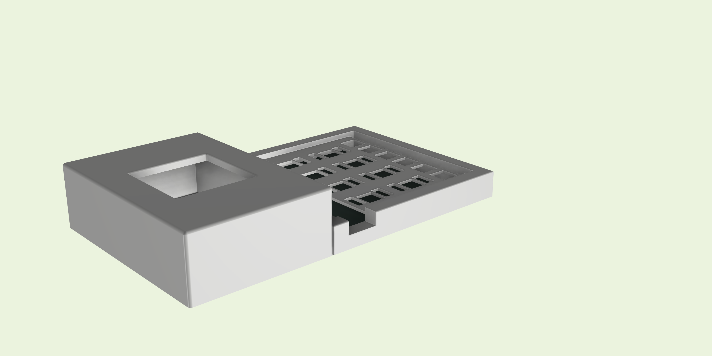
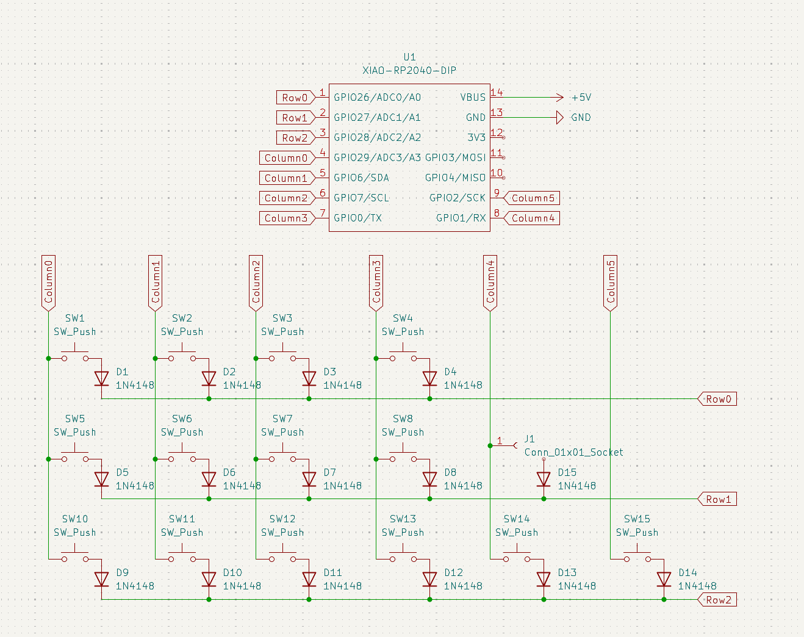
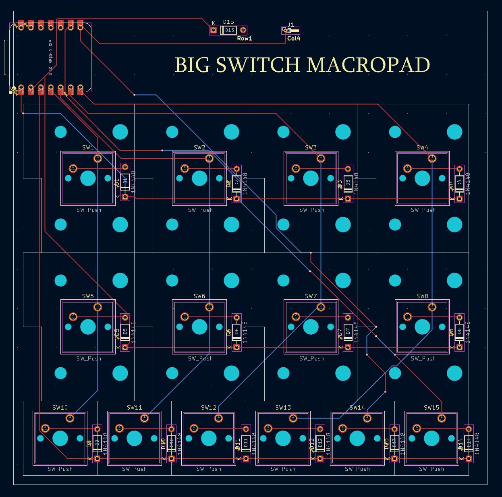
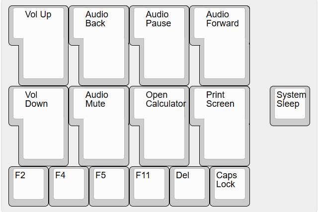

# Big_Switch_Pad

  

  

BIG SWITCH MACROPAD is a custom macropad featuring a 2×4 cluster of ISO Enter keys stacked above a 1×6 row of 1u keys. Looming over the layout is a Kailh Big Switch that serves as the visual and functional centerpiece of the board. The pad runs QMK Firmware and is powered by an RP2040 microcontroller.

  

## Features:

  

- KAILH BIG SWITCH

  

- 8 x ISO ENTER Keys

  

- 6 x 1u Keys

  

- QMK Firmware

- 3d Printed Case

  

  

## CAD Model:

  

The main case section fits together using M3 x 16mm bolts and M3x5mmx4mm heatset inserts. 
The big switch housing is connected to main body using 6mm Diameter x 1.5mm magnets.

Here are some renders of the assembled case:

  

Case designed in Fusion360.

  

  

## PCB

  

PCB designed in KiCad. The Diode and Through-hole near the top must be handwired to the big switch.

Schematic:

  

  

PCB:

  

  

## Firmware

  
  

This project utilizes [QMK](https://qmk.fm/) firmware.

  

Here is the Default Keymap and Keycodes Assigned to it:

 

- The Big Switch acts as a large "off button" and is wired into the Matrix

  

  

## BOM:

  

Here is the list of parts required for this project:

  

  

- 14x Cherry MX switches

- 1x Kailh Big Switch (available at Novelkeys)

- 6x 1u Keycaps (any profile)

- 8x ISO Enter Keys

- 8x 2u Stabilizers (Semi-optional)

- 1x Seeed XIAO RP2040

- 2x Hookup Wire Segments (Approx. 6 inches each)

- 4x 6mm Diameter x 1.5mm Height Magnets

- 15x Through-hole 1N4148 Diodes

-  M3x16mm bolts

- M3x5mx4mm heatset inserts

- 1x Case (3 printed parts)
